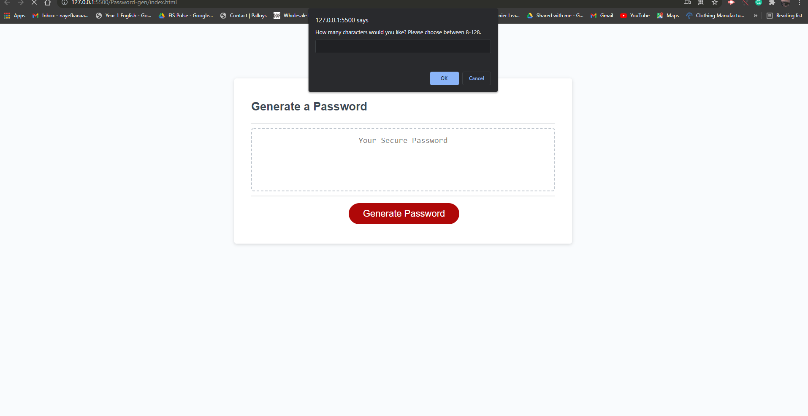

# Password Generator

 ### This Generator was made using vanilla javascript for functionality, html for structure, and css for that splash of color!

## What does it do?
    1. Asks the user to pick from 8-128 characters.
    2. Asks the user if they want to include uppercase letters, lowercase letters, numbers, or special characters (or all of them)
    3. The script written will then randomly generate a password for the user and display it on the screen
    
# Screenshots

## Prompt alert asking for range of numbers.

    

## Benefits!
    - Alt attributes increase SEO in addition to providing accessibility to end-users.

    - Semantic elements added to increase accessibility for users and also providing better SEO optimization.
    
    -Title attributes provide same benefits as Alt attributes in cases where Alt can not be used 

    -CSS and HTML comments and links help other developers understand what others left behind.

### Link to Github pages:
   # https://nbk-01.github.io/Horiseon-SEO-optimized/
